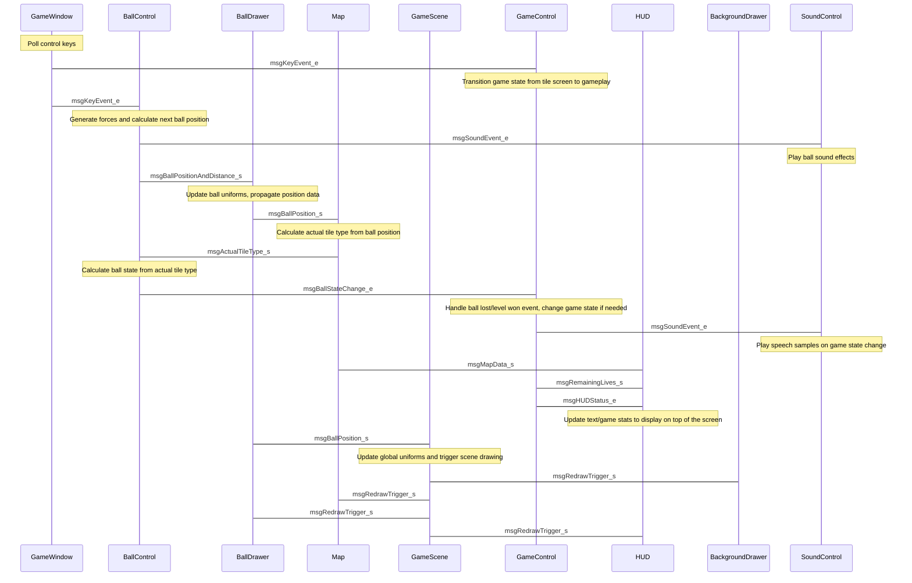

# Project summary
This is an OpenGL based remake of the classic game released originally for various 8-bit computers (like Commodore and Amiga) under the same title. Based on my favorite childhood game from 1986 I've played on my Commodore 16, a product of the now defunct software studio Gremlin Graphics.

### Raison d'être
I am working as a software developer for more than 10 years (mostly working on computer vision and embedded projects) and this time I wanted to create something very different. My original intention was to [learn OpenGL](https://learnopengl.com/) in a pragmatic way to gain skills I can use in my professional career. 

Eventually, as I have faced more and more challenges of such a complex thing as a game development, it evolved to something between a multimedia project (eg. the game features my self-composed music) and an open source development (contains reusable components, that can be reused in other, even non-game projects as well - see details below).

## Features
* Lead the ball on the race tracks floating above planets of the solar system to the finish line through 10 exciting levels
* Own map format, levels can be edited/new ones can be created using the supplied python script or with hex editor
* Breathtaking sci-fi inspired background artworks generated by AI [(NightCafé)](https://creator.nightcafe.studio/studio)
* Self-composed theme music recorded with [my experimental/ambient project](https://thetruemorkskog.bandcamp.com/music)
* The sound effects are also self-recorded using analogue synthesizers

# Quick start
If you just want to try the game maybe the easiest way is to download the Windows x64 builds I have provided on the Releases page. The game was originally developed on Ubuntu 20, but I have prepared Windows binaries for download as well for testing purposes.

## Building from source
If you want to build the game from sources, you'll need the following libraries:
* GLFW3
* GLM
* LibPNG
* SFML (audio and system components)

The supplied CMake project file can be used to build the project. I have tested with GCC 9.4.0, but probably any compiler will do the job that supports at least the C++20 standard, however on Windows you might need to work from homebrew libraries.

## Game instructions
Control the ball with the left and right arrow keys (or alternatively A and D) and jump with SPACE/left CTRL. Light green tiles will speed up the ball, which allows longer jumps, while light red tiles slows down the ball to the initial speed.

# Reusable parts of the project
The project's source code contains some parts which can be useful maybe even for your projects, which is offered for free reuse under the Unlicense.

## GLKit
The heart and soul of the game graphics is a self-developed wrapper around OpenGL, which uses modern C++ design principles for type and memory safe, convenient use of OpenGL. Also the subcomponents are as decoupled as it was possible, so they can be used even without each other if you are just looking for some of the following (see `include/glkit/core` for details):
* `buffers`, for safe usage of VAO's, VBO's and EBO's, designed using the RAII principles. 
* `shaders`, for compiling and wrapping shader programs, satisfying the requirements of modern OpenGL development using the core profile (supports geometry and tesselation shaders in addition to the mandatory vertex and fragment shader)
* `uniforms`, for type safe and versatile handling and updating shader uniform variables using modern C++'s compile time features and lambdas

Please note, that the GLKit core component uses OpenGL bindings provided by GLAD, which is committed into this repo, as it is generated using a [web service](https://glad.dav1d.de/).

## State machine
The project features a single-header state machine API, also relying on modern C++'s functional features. It is a fairly new addition to the game's codebase, but it was needed to clean up the game's main state handling (realized in `GameControl_c`), which was a huge mess by the finishing the planned functionalities with lots of `if`'s. Also I had lots of negative experiences during my professional career with poorly designed state machines, which always led to obfuscated and hard-to-maintain code, so I decided to make an abstract representation of this commonly used model.

The fundamental type of this API is a class representing a state transition, which defines the initial and a target state. `StateMachine_c` maintains a collection of these objects and it's responsibility is to store the actual state and facilitate the transitions. Transitions are only possible through it's public API (`performTransition()`). So it is ensured, that no unwanted or illegal state change will take place. A transition happens and `State` changes if a predicate defined in the state transition object tests as true. In addition, there are two special functors which can be defined in a transition object, where the API user can implement extra functionality which will be executed if the transition was happened and also if not. Thanks to this, the original `GameControl_c` code, which featured `if`'s up to three levels depth was replaced by 11 elegant calls of `addTransition()`.

## Messaging
The most important part of the game (other than the graphics engine) is the `messaging` component, which drives the main game loop and all the information circulating between the different components of the game, while ensuring that the different components are as separate from each other as it's possible It is a realization of the Observer pattern, with a twist using modern template-driven features like `std::any`.

Just like in the case of the original design pattern, the purpose of this component is to decrease the coupling between the classes and realize an event-driven architecture. Using this API classes can to subscribe for messages of specific types and they can also send messages of any types. The message traffic is facilitated by a class called `PostOffice_c`. If a message is sent somewhere it triggers all the classes which are subscribed to the type of the message and will receive the information in it. The type of the message can be anything, however strong types are recommended (even if it contains a single, built-in type). In the game I also use `enum class` types and even a tag struct `msgRedrawTrigger_s`, which is empty, because the information is the message itself.

Using this interface the classes of the game does not need to know anything of each other (no pointers/references to other classes, no tons of messy includes, no objects which needs to know the full class declaration of a bunch of other classes etc.). They only need to know what messages do they need to operate on, so the development of components of separate responsibility is easier and also safer to maintain - which is very important in video games, where a board range of tasks shall be carried out in a single loop by many classes.

To use the API a copy of `PostOffice_c` (perferably in a central part of the application, in my case the main `Game_c` class, which realizes the game loop) shall be instantiated, and the target classes shall:
* inherit from `MessageRecipient_i`and pass a pointer to the `PostOffice_c` instance to the parent class' constructor
* subscribe to the messages of interest in the constructor
* implement sendMessage() which will receive the message of std::any type whenever a message of the subscribed type appears in the system
* and optionally can emit messages using `PO->broadcastMessage(...)` of any type, to be handled by some other child class of `MessageRecipient_i`

## Message sequence diagram for the game
The following messages are realized by the mechanism described above. Thanks to the `messaging` API the main game loop only triggers the first class (`GameWindow_c`), which polls the keyboard and everything else happens out of reach of the main Game class and the cascade of messages will ultimately ends up at the so-called redraw triggers, which updates the actual game scene.

## Rigid Body Physics
The game physics were realized using the provided `rigidbody` component (which also features a separate `Vector3D_s` type, despite that the project features GLM, so this small API has no external dependencies). It can be also used in other projects, but maybe it's too minimal, as it represents only a single particle, but it was enough for the game. Now I planning to develop another game where I might extend this API as well.
